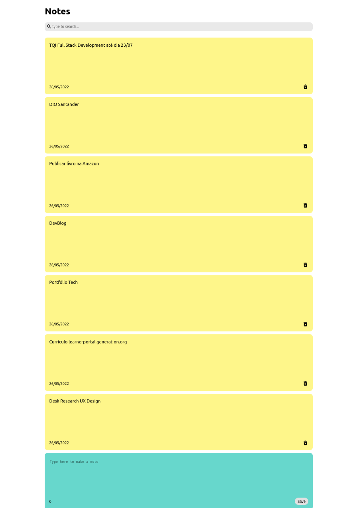

# ReactNotesApp

Live: [https://628fd53ffc5a7314d466a7d6--fascinating-alpaca-5e4622.netlify.app/](https://628fd53ffc5a7314d466a7d6--fascinating-alpaca-5e4622.netlify.app/)

Responsible Note taking app with React and CSS.

Write and saves notes.

The notes are stored with localStorage JavaScript property.

This mean it will be saved locally, on clients browser.

## Raw React Files

after git clone https://github.com/petry078/ReactNotesApp.git:

* cd raw;
* npm install;
* npm start.
